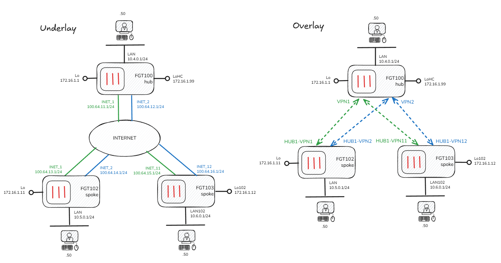

# Fortinet SD-WAN CLI

## Overview

FortiManager is great (and recommended) for deploying and managing Fortinet SD-WAN. However, SD-WAN can be configured on the FortiGates via the GUI or CLI without any centralised management. This article describes configuring a small SD-WAN deployment using only the CLI. 

This article is not a full explanation of Fortinet SD-WAN technology and features; please see the official documentation here.
https://docs.fortinet.com/document/fortigate/7.4.6/administration-guide/19246/sd-wan

## Design Details

* Single Hub, 2 Spokes (all on 7.4)
* Dual internet underlay at all sites
* DHCP on internet facing interfaces
* IPSEC overlay with ADVPN
* BGP dynamic routing in overlay, using 'BGP on loopback' design
* BGP Route-Reflector on hub (not dynamic BGP approach)
* ANY outbound internet access permitted from LANs at all sites
* ANY-to-ANY access permitted between LANs at all sites
* Simple load-balancing and failover for internet and overlay traffic (add application routing rules at your leisure!)


> NOTE: While the configurations here can be used as the basis for a real deployment, they should not be considered 'production ready'. For instance, there is no filtering on the BGP peers and the firewall policies are somewhat open ;)

### Diagrams




## Configuration

> NOTE: The following CLI configurations do not contain any base system or interface config, as that is very specific to my lab. Details of lab setup *coming soon*

### Hub (FGT100)

Loopback interfaces for BGP and SD-WAN health-check:
```
config system interface
    edit "Lo-HC"
        set ip 172.16.1.99 255.255.255.255
        set allowaccess ping
        set type loopback
    next
    edit "Lo"
        set ip 172.16.1.1 255.255.255.255
        set allowaccess ping
        set type loopback
```

IPSEC Phase1:
```
config vpn ipsec phase1-interface
    edit "VPN1"
        set type dynamic
        set interface "INET_1"
        set ike-version 2
        set peertype any
        set net-device disable
        set exchange-ip-addr4 172.16.1.1
        set proposal aes256gcm-prfsha256 aes256-sha256
        set add-route disable
        set dpd on-idle
        set auto-discovery-sender enable
        set psksecret P455W0rd!
        set dpd-retryinterval 60
    next
    edit "VPN2"
        set type dynamic
        set interface "INET_2"
        set ike-version 2
        set peertype any
        set net-device disable
        set exchange-ip-addr4 172.16.1.1
        set proposal aes256gcm-prfsha256 aes256-sha256
        set add-route disable
        set dpd on-idle
        set auto-discovery-sender enable
        set psksecret P455W0rd!
        set dpd-retryinterval 60
    next
end
```

IPSEC Phase2:
```
config vpn ipsec phase2-interface
    edit "VPN1"
        set phase1name "VPN1"
        set proposal aes256gcm
        set keepalive enable
    next
    edit "VPN2"
        set phase1name "VPN2"
        set proposal aes256gcm
        set keepalive enable
    next
end
```

BGP:
```
config router bgp
    set as 65000
    set router-id 172.16.1.1
    set keepalive-timer 15
    set holdtime-timer 45
    set ebgp-multipath enable
    set ibgp-multipath enable
    set additional-path enable
    set recursive-next-hop enable
    set recursive-inherit-priority enable
    set graceful-restart enable
    set additional-path-select 255
    config neighbor-group
        edit "ADVPN"
            set advertisement-interval 1
            set capability-graceful-restart enable
            set next-hop-self enable
            set soft-reconfiguration enable
            set interface "Lo"
            set remote-as 65000
            set update-source "Lo"
            set route-reflector-client enable
        next
    end
    config neighbor-range
        edit 1
            set prefix 172.16.1.0 255.255.255.0
            set neighbor-group "ADVPN"
        next
    end
    config network
        edit 2
            set prefix 10.4.0.0 255.255.255.0
        next
        edit 3
            set prefix 172.16.1.99 255.255.255.255
        next
    end
```

SD-WAN:
```
config system sdwan
    set status enable
    config zone
        edit "virtual-wan-link"
        next
        edit "underlay"
        next
        edit "overlay"
        next
    end
    config members
        edit 1
            set interface "INET_1"
            set zone "underlay"
        next
        edit 2
            set interface "INET_2"
            set zone "underlay"
        next
        edit 3
            set interface "VPN1"
            set zone "overlay"
            set priority 10
        next
        edit 4
            set interface "VPN2"
            set zone "overlay"
            set priority 10
        next
    end

config router static
    edit 100
        set distance 1
        set sdwan-zone "underlay"
    next
end
```

Firewall Policy:
```
config firewall address
    edit "CORP_LAN"
        set subnet 10.0.0.0/8
  next
end

config firewall policy
    edit 1
        set name "BGP"
        set srcintf "overlay"
        set dstintf "Lo"
        set action accept
        set srcaddr "all"
        set dstaddr "all"
        set schedule "always"
        set service "PING" "BGP"
    next
    edit 4
        set name "HUB_HC"
        set srcintf "overlay"
        set dstintf "Lo-HC"
        set action accept
        set srcaddr "all"
        set dstaddr "all"
        set schedule "always"
        set service "ALL_ICMP"
    next
    edit 2
        set name "CORPORATE"
        set srcintf "LAN" "overlay"
        set dstintf "LAN" "overlay"
        set action accept
        set srcaddr "CORP_LAN"
        set dstaddr "CORP_LAN"
        set schedule "always"
        set service "ALL"
        set logtraffic all
    next
    edit 3
        set name "DIA"
        set srcintf "LAN"
        set dstintf "underlay"
        set action accept
        set srcaddr "all"
        set dstaddr "all"
        set schedule "always"
        set service "ALL"
        set nat enable
    next
end
```

### Spoke1 (FGT102)

Loopback interface for BGP
```
config system interface
    edit "Lo102"
        set ip 172.16.1.12 255.255.255.255
        set allowaccess ping
        set type loopback
    next
end
```

IPSEC Phase1:
```
config vpn ipsec phase1-interface
    edit "HUB1-VPN1"
        set interface "INET_1"
        set ike-version 2
        set peertype any
        set net-device enable
        set exchange-ip-addr4 172.16.1.11
        set proposal aes256gcm-prfsha256 aes256-sha256
        set add-route disable
        set dpd on-idle
        set auto-discovery-receiver enable
        set remote-gw 100.64.11.1
        set psksecret P455W0rd!
    next
    edit "HUB1-VPN2"
        set interface "INET_2"
        set ike-version 2
        set peertype any
        set net-device enable
        set exchange-ip-addr4 172.16.1.11
        set proposal aes256gcm-prfsha256 aes256-sha256
        set add-route disable
        set dpd on-idle
        set auto-discovery-receiver enable
        set remote-gw 100.64.12.1
        set psksecret P455W0rd!
    next
end
```

IPSEC Phase1:
```
config vpn ipsec phase2-interface
    edit "HUB1-VPN1"
        set phase1name "HUB1-VPN1"
        set proposal aes256gcm
        set keepalive enable
    next
    edit "HUB1-VPN2"
        set phase1name "HUB1-VPN2"
        set proposal aes256gcm
        set keepalive enable
    next
end
```

BGP:
```
config router bgp
    set as 65000
    set router-id 172.16.1.11
    set keepalive-timer 15
    set holdtime-timer 45
    set ibgp-multipath enable
    set additional-path enable
    set recursive-next-hop enable
    set graceful-restart enable
    set additional-path-select 255
    config neighbor
        edit "172.16.1.1"
            set advertisement-interval 1
            set capability-graceful-restart enable
            set soft-reconfiguration enable
            set interface "Lo"
            set remote-as 65000
            set connect-timer 1
            set update-source "Lo"
        next
    end
    config network
        edit 1
            set prefix 10.5.0.0 255.255.255.0
        next
    end
end
```

SD-WAN:
```
config system sdwan
    set status enable
    config zone
        edit "virtual-wan-link"
        next
        edit "underlay"
        next
        edit "overlay"
            set advpn-select enable
        next
    end
    config members
        edit 1
            set interface "INET_1"
            set zone "underlay"
        next
        edit 2
            set interface "INET_2"
            set zone "underlay"
        next
        edit 3
            set interface "HUB1-VPN1"
            set zone "overlay"
            set preferred-source 172.16.1.11
            set source 172.16.1.11
            set priority 10
        next
        edit 4
            set interface "HUB1-VPN2"
            set zone "overlay"
            set preferred-source 172.16.1.11
            set source 172.16.1.11
            set priority 10
        next
    end
    config health-check
            edit "HUB_HC"
            set server "172.16.1.99"
            set members 4 3
        next
    end
    config service
        edit 1
            set name "CORP"
            set load-balance enable
            set dst "CORP_LAN"
            set src "CORP_LAN"
            set priority-members 3 4
            set priority-zone "overlay"
        next
    end
end

config router static
    edit 100
        set distance 1
        set sdwan-zone "underlay"
    next
end
```

Firewall Policy:
```
config firewall address
    edit "CORP_LAN"
        set subnet 10.0.0.0/8
  next
end

config firewall policy
    edit 1
        set name "BGP"
        set srcintf "overlay"
        set dstintf "Lo"
        set action accept
        set srcaddr "all"
        set dstaddr "all"
        set schedule "always"
        set service "PING" "BGP"
    next
    edit 2
        set name "CORPORATE"
        set srcintf "LAN" "overlay"
        set dstintf "LAN" "overlay"
        set action accept
        set srcaddr "CORP_LAN"
        set dstaddr "CORP_LAN"
        set schedule "always"
        set service "ALL"
        set logtraffic all
    next
    edit 3
        set name "DIA"
        set srcintf "LAN"
        set dstintf "underlay"
        set action accept
        set srcaddr "all"
        set dstaddr "all"
        set schedule "always"
        set service "ALL"
        set nat enable
    next
end
```

### Spoke2 (FGT102)
Configuration hasn't been included here as identical to Spoke1 with the relevant interfaces and IPs changed.

## Verfication
tba