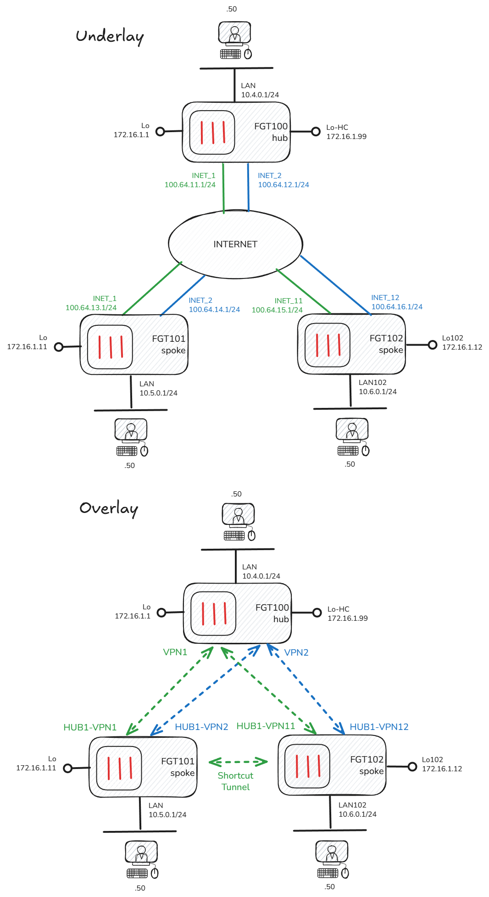

# Fortinet SD-WAN CLI

## Contents

- [Overview](#introduction)
- [Design Details](#design-details)
  - [Specification](#specification)
  - [Diagrams](#diagrams)
- [Configuration](#configuration)
  - [Hub (FGT100)](#hub-fgt100)
    - [Loopback Interfaces](#loopback-interfaces)
    - [IPSEC Phase1](#ipsec-phase1)
    - [IPSEC Phase2](#ipsec-phase2)
    - [BGP](#bgp)
    - [SD-WAN and Static Routes](#sd-wan-and-static-routes)
    - [Firewall Policy](#firewall-policy)
  - [Spoke1 (FGT101)](#spoke1-fgt101)
    - [Loopback Interface](#loopback-interface)
    - [IPSEC Phase1](#ipsec-phase1-1)
    - [IPSEC Phase2](#ipsec-phase2-1)
    - [BGP](#bgp-1)
    - [SD-WAN and Static Routes](#sd-wan-and-static-routes-1)
    - [Firewall Policy](#firewall-policy-1)
  - [Spoke2 (FGT102)](#spoke2-fgt102)
- [Verification](#verification)
- [Conclusion](#conclusion)
- [Further Reading](#further-reading)

## Introduction

While FortiManager is the preferred tool for managing Fortinet SD-WAN at scale, SD-WAN can be configured on the FortiGates via the GUI or CLI without any centralised management. This article describes configuring a small SD-WAN deployment using only the CLI. 

This article is not a full explanation of Fortinet SD-WAN technology and features; refer to the official documentation for further details:

https://docs.fortinet.com/sdwan

## Design Details

### Specification

* Single Hub, 2 Spokes (all on 7.4)
* Dual internet underlay at all sites
* DHCP on internet facing interfaces
* IPSEC overlay with [ADVPN](https://docs.fortinet.com/document/fortigate/7.4.8/administration-guide/637049/advpn-2-0-edge-discovery-and-path-management)
* BGP dynamic routing in overlay, using [BGP on loopback](https://docs.fortinet.com/document/fortigate/7.4.0/sd-wan-sd-branch-architecture-for-mssps/53445/bgp-on-loopback) design
* BGP [Route-Reflector](https://community.fortinet.com/t5/FortiGate/Technical-Tip-Configuring-BGP-route-reflector/ta-p/191503) on hub
* ANY outbound internet access permitted from LANs at all sites
* ANY-to-ANY access permitted between LANs at all sites
* Simple load-balancing and failover for internet and overlay traffic (add application routing rules at your leisure!)


> NOTE: While the configurations provided in this article can be used as the basis for a real deployment, they should not be considered 'production ready'. For instance, there is no filtering on the BGP peers and the firewall policies are somewhat open ;)

### Diagrams




## Configuration

> NOTE: The following CLI configurations do not contain any base system or interface config, as that is very specific to my lab. Details of lab setup [here](https://github.com/jtanderson2/fortinet-lab)

### Hub (FGT100)

#### Loopback Interfaces:
```
config system interface
    edit "Lo-HC"
        set ip 172.16.1.99 255.255.255.255
        set allowaccess ping
        set type loopback
    next
    edit "Lo"
        set ip 172.16.1.1 255.255.255.255
        set allowaccess ping
        set type loopback
```

#### IPSEC Phase1:
```
config vpn ipsec phase1-interface
    edit "VPN1"
        set type dynamic
        set interface "INET_1"
        set ike-version 2
        set peertype any
        set net-device disable
        set exchange-ip-addr4 172.16.1.1
        set proposal aes256gcm-prfsha256 aes256-sha256
        set add-route disable
        set dpd on-idle
        set auto-discovery-sender enable
        set psksecret P455W0rd!
        set dpd-retryinterval 60
    next
    edit "VPN2"
        set type dynamic
        set interface "INET_2"
        set ike-version 2
        set peertype any
        set net-device disable
        set exchange-ip-addr4 172.16.1.1
        set proposal aes256gcm-prfsha256 aes256-sha256
        set add-route disable
        set dpd on-idle
        set auto-discovery-sender enable
        set psksecret P455W0rd!
        set dpd-retryinterval 60
    next
end
```

#### IPSEC Phase2:
```
config vpn ipsec phase2-interface
    edit "VPN1"
        set phase1name "VPN1"
        set proposal aes256gcm
        set keepalive enable
    next
    edit "VPN2"
        set phase1name "VPN2"
        set proposal aes256gcm
        set keepalive enable
    next
end
```

#### BGP:
```
config router bgp
    set as 65000
    set router-id 172.16.1.1
    set keepalive-timer 15
    set holdtime-timer 45
    set ebgp-multipath enable
    set ibgp-multipath enable
    set additional-path enable
    set recursive-next-hop enable
    set recursive-inherit-priority enable
    set graceful-restart enable
    set additional-path-select 255
    config neighbor-group
        edit "ADVPN"
            set advertisement-interval 1
            set capability-graceful-restart enable
            set next-hop-self enable
            set soft-reconfiguration enable
            set interface "Lo"
            set remote-as 65000
            set update-source "Lo"
            set route-reflector-client enable
        next
    end
    config neighbor-range
        edit 1
            set prefix 172.16.1.0 255.255.255.0
            set neighbor-group "ADVPN"
        next
    end
    config network
        edit 2
            set prefix 10.4.0.0 255.255.255.0
        next
        edit 3
            set prefix 172.16.1.99 255.255.255.255
        next
            edit 4
            set prefix 172.16.0.0 255.240.0.0
        next
    end
```

#### SD-WAN and Static Routes:
```
config system sdwan
    set status enable
    config zone
        edit "virtual-wan-link"
        next
        edit "underlay"
        next
        edit "overlay"
        next
    end
    config members
        edit 1
            set interface "INET_1"
            set zone "underlay"
        next
        edit 2
            set interface "INET_2"
            set zone "underlay"
        next
        edit 3
            set interface "VPN1"
            set zone "overlay"
            set priority 10
        next
        edit 4
            set interface "VPN2"
            set zone "overlay"
            set priority 10
        next
    end

config router static
    edit 100
        set distance 1
        set sdwan-zone "underlay"
    next
    edit 101
        set dst 172.16.0.0 255.240.0.0
        set blackhole enable
    next    
end

```

#### Firewall Policy:
```
config firewall address
    edit "CORP_LAN"
        set subnet 10.0.0.0/8
  next
end

config firewall policy
    edit 1
        set name "BGP"
        set srcintf "overlay"
        set dstintf "Lo"
        set action accept
        set srcaddr "all"
        set dstaddr "all"
        set schedule "always"
        set service "PING" "BGP"
    next
    edit 4
        set name "HUB_HC"
        set srcintf "overlay"
        set dstintf "Lo-HC"
        set action accept
        set srcaddr "all"
        set dstaddr "all"
        set schedule "always"
        set service "ALL_ICMP"
    next
    edit 2
        set name "CORPORATE"
        set srcintf "LAN" "overlay"
        set dstintf "LAN" "overlay"
        set action accept
        set srcaddr "CORP_LAN"
        set dstaddr "CORP_LAN"
        set schedule "always"
        set service "ALL"
        set logtraffic all
    next
    edit 3
        set name "DIA"
        set srcintf "LAN"
        set dstintf "underlay"
        set action accept
        set srcaddr "all"
        set dstaddr "all"
        set schedule "always"
        set service "ALL"
        set nat enable
    next
end
```

### Spoke1 (FGT101)

#### Loopback Interface:
```
config system interface
    edit "Lo102"
        set ip 172.16.1.12 255.255.255.255
        set allowaccess ping
        set type loopback
    next
end
```

#### IPSEC Phase1:
```
config vpn ipsec phase1-interface
    edit "HUB1-VPN1"
        set interface "INET_1"
        set ike-version 2
        set peertype any
        set net-device enable
        set exchange-ip-addr4 172.16.1.11
        set proposal aes256gcm-prfsha256 aes256-sha256
        set add-route disable
        set dpd on-idle
        set auto-discovery-receiver enable
        set remote-gw 100.64.11.1
        set psksecret P455W0rd!
    next
    edit "HUB1-VPN2"
        set interface "INET_2"
        set ike-version 2
        set peertype any
        set net-device enable
        set exchange-ip-addr4 172.16.1.11
        set proposal aes256gcm-prfsha256 aes256-sha256
        set add-route disable
        set dpd on-idle
        set auto-discovery-receiver enable
        set remote-gw 100.64.12.1
        set psksecret P455W0rd!
    next
end
```

#### IPSEC Phase2:
```
config vpn ipsec phase2-interface
    edit "HUB1-VPN1"
        set phase1name "HUB1-VPN1"
        set proposal aes256gcm
        set keepalive enable
    next
    edit "HUB1-VPN2"
        set phase1name "HUB1-VPN2"
        set proposal aes256gcm
        set keepalive enable
    next
end
```

#### BGP:
```
config router bgp
    set as 65000
    set router-id 172.16.1.11
    set keepalive-timer 15
    set holdtime-timer 45
    set ibgp-multipath enable
    set additional-path enable
    set recursive-next-hop enable
    set graceful-restart enable
    set additional-path-select 255
    config neighbor
        edit "172.16.1.1"
            set advertisement-interval 1
            set capability-graceful-restart enable
            set soft-reconfiguration enable
            set interface "Lo"
            set remote-as 65000
            set connect-timer 1
            set update-source "Lo"
        next
    end
    config network
        edit 1
            set prefix 10.5.0.0 255.255.255.0
        next
    end
end
```

#### SD-WAN and Static Routes:
```
config system sdwan
    set status enable
    config zone
        edit "virtual-wan-link"
        next
        edit "underlay"
        next
        edit "overlay"
            set advpn-select enable
        next
    end
    config members
        edit 1
            set interface "INET_1"
            set zone "underlay"
        next
        edit 2
            set interface "INET_2"
            set zone "underlay"
        next
        edit 3
            set interface "HUB1-VPN1"
            set zone "overlay"
            set preferred-source 172.16.1.11
            set source 172.16.1.11
            set priority 10
        next
        edit 4
            set interface "HUB1-VPN2"
            set zone "overlay"
            set preferred-source 172.16.1.11
            set source 172.16.1.11
            set priority 10
        next
    end
    config health-check
            edit "HUB_HC"
            set server "172.16.1.99"
            set members 4 3
        next
    end
    config service
        edit 1
            set name "CORP"
            set load-balance enable
            set dst "CORP_LAN"
            set src "CORP_LAN"
            set priority-members 3 4
            set priority-zone "overlay"
        next
    end
end

config router static
    edit 100
        set distance 1
        set sdwan-zone "underlay"
    next
end
```

#### Firewall Policy:
```
config firewall address
    edit "CORP_LAN"
        set subnet 10.0.0.0/8
  next
end

config firewall policy
    edit 1
        set name "BGP"
        set srcintf "overlay"
        set dstintf "Lo"
        set action accept
        set srcaddr "all"
        set dstaddr "all"
        set schedule "always"
        set service "PING" "BGP"
    next
    edit 2
        set name "CORPORATE"
        set srcintf "LAN" "overlay"
        set dstintf "LAN" "overlay"
        set action accept
        set srcaddr "CORP_LAN"
        set dstaddr "CORP_LAN"
        set schedule "always"
        set service "ALL"
        set logtraffic all
    next
    edit 3
        set name "DIA"
        set srcintf "LAN"
        set dstintf "underlay"
        set action accept
        set srcaddr "all"
        set dstaddr "all"
        set schedule "always"
        set service "ALL"
        set nat enable
    next
end
```

### Spoke2 (FGT102)
Configuration hasn't been included here as identical to Spoke1 with the relevant interfaces and IPs changed.

## Verification

Ping checks:
```
# spoke1 lan - hub lan
jta@mint5:~$ ping 10.4.0.50
PING 10.4.0.50 (10.4.0.50) 56(84) bytes of data.
64 bytes from 10.4.0.50: icmp_seq=1 ttl=62 time=1.13 ms
64 bytes from 10.4.0.50: icmp_seq=2 ttl=62 time=0.806 ms
64 bytes from 10.4.0.50: icmp_seq=3 ttl=62 time=0.770 ms

# spoke1 lan - spoke2 lan
jta@mint5:~$ ping 10.6.0.50
PING 10.6.0.50 (10.6.0.50) 56(84) bytes of data.
64 bytes from 10.6.0.50: icmp_seq=1 ttl=253 time=1.38 ms
64 bytes from 10.6.0.50: icmp_seq=2 ttl=253 time=1.50 ms
64 bytes from 10.6.0.50: icmp_seq=3 ttl=253 time=1.12 ms
```

Verify tunnels are up:
```
# FGT100 (hub)
get vpn ipsec tunnel summary 
'VPN1_0' 100.64.15.1:0  selectors(total,up): 1/1  rx(pkt,err): 83904/0  tx(pkt,err): 83904/0
'VPN1_1' 100.64.13.1:0  selectors(total,up): 1/1  rx(pkt,err): 83961/0  tx(pkt,err): 83947/0
'VPN2_0' 100.64.16.1:0  selectors(total,up): 1/1  rx(pkt,err): 71951/0  tx(pkt,err): 71951/0
'VPN2_1' 100.64.14.1:0  selectors(total,up): 1/1  rx(pkt,err): 71950/0  tx(pkt,err): 71947/0

# hub has 4 tunnels, 1 over each underlay to each spoke

# FGT101 (spoke1)
get vpn ipsec tunnel summary
'HUB1-VPN1_0' 100.64.15.1:0  selectors(total,up): 1/1  rx(pkt,err): 181248/0  tx(pkt,err): 181341/2
'HUB1-VPN1' 100.64.11.1:0  selectors(total,up): 1/1  rx(pkt,err): 84124/0  tx(pkt,err): 84136/1
'HUB1-VPN2' 100.64.12.1:0  selectors(total,up): 1/1  rx(pkt,err): 72112/0  tx(pkt,err): 72115/6181

# FGT102 (spoke2)
get vpn ipsec tunnel summary
'HUB1-VPN11_0' 100.64.13.1:0  selectors(total,up): 1/1  rx(pkt,err): 181616/0  tx(pkt,err): 181520/2
'HUB1-VPN11' 100.64.11.1:0  selectors(total,up): 1/1  rx(pkt,err): 84229/0  tx(pkt,err): 84229/1
'HUB1-VPN12' 100.64.12.1:0  selectors(total,up): 1/1  rx(pkt,err): 72252/0  tx(pkt,err): 72252/6182

# spokes have 3 tunnels, 1 over each underlay to the hub, and an ADVPN shortcut tunnel directly between spokes - 'HUB1-VPN1_0'
```

At this point things are looking healthy, but lets take a look at the routing tables, first on the hub:

```
# FGT100 (hub)
get router info routing-table all
<--- output omitted --->

Routing table for VRF=0
S*      0.0.0.0/0 [1/0] via 100.64.11.254, INET_1, [1/0]
                  [1/0] via 100.64.12.254, INET_2, [1/0]
C       10.4.0.0/24 is directly connected, LAN
B       10.5.0.0/24 [200/0] via 172.16.1.11 (recursive via VPN1 tunnel 172.16.1.11 [1]), 11:27:21
                                            (recursive via VPN2 tunnel 10.0.0.17 [1]), 11:27:21, [1/0]
B       10.6.0.0/24 [200/0] via 172.16.1.12 (recursive via VPN1 tunnel 172.16.1.12 [1]), 12:26:41
                                            (recursive via VPN2 tunnel 10.0.0.16 [1]), 12:26:41, [1/0]
C       100.64.11.0/24 is directly connected, INET_1
C       100.64.12.0/24 is directly connected, INET_2
S       172.16.0.0/12 [10/0] is a summary, Null, [1/0]
C       172.16.1.1/32 is directly connected, Lo
S       172.16.1.11/32 [15/0] via VPN1 tunnel 172.16.1.11, [1/0]
                       [15/0] via VPN2 tunnel 10.0.0.17, [1/0]
S       172.16.1.12/32 [15/0] via VPN1 tunnel 172.16.1.12, [1/0]
                       [15/0] via VPN2 tunnel 10.0.0.16, [1/0]
C       172.16.1.99/32 is directly connected, Lo-HC
C       192.168.0.0/24 is directly connected, internal
```
We can see 2 equal cost paths to each of the spokes' LAN ranges recursing via the respective sites' loopback; note the 'static' routes for the loopbacks which are required for the route recursion to function. They are not configured static routes in the normal sense, but are injected via this command in the ipsec phase1 settings: 

```set exchange-ip-addr4 172.16.1.1x```

This is used on both hubs and spokes to advertise their respective loopbacks over the tunnels and is key to how a 'BGP on Loopback' design works without the need for another dynamic routing protocol.

Now lets take look at a spoke routing table:

```
#FGT101 (spoke1)
get router info routing-table all
<--- output omitted --->

Routing table for VRF=0
S*      0.0.0.0/0 [1/0] via 100.64.13.254, INET_1, [1/0]
                  [1/0] via 100.64.14.254, INET_2, [1/0]
B       10.4.0.0/24 [200/0] via 172.16.1.1 (recursive via HUB1-VPN1 tunnel 100.64.11.1), 12:51:31
                                           (recursive via HUB1-VPN2 tunnel 100.64.12.1), 12:51:31, [1/0]
C       10.5.0.0/24 is directly connected, LAN
B       10.6.0.0/24 [200/0] via 172.16.1.12 (recursive via HUB1-VPN1_0 tunnel 100.64.15.1), 11:03:43, [1/0]
C       100.64.13.0/24 is directly connected, INET_1
C       100.64.14.0/24 is directly connected, INET_2
B       172.16.0.0/12 [200/0] via 172.16.1.1 (recursive via HUB1-VPN1 tunnel 100.64.11.1), 11:04:51
                                             (recursive via HUB1-VPN2 tunnel 100.64.12.1), 11:04:51, [1/0]
S       172.16.1.1/32 [15/0] via HUB1-VPN1 tunnel 100.64.11.1, [1/0]
                      [15/0] via HUB1-VPN2 tunnel 100.64.12.1, [1/0]
C       172.16.1.11/32 is directly connected, Lo
S       172.16.1.12/32 [15/0] via HUB1-VPN1_0 tunnel 100.64.15.1, [1/0]
B       172.16.1.99/32 [200/0] via 172.16.1.1 (recursive via HUB1-VPN1 tunnel 100.64.11.1), 12:51:31
                                              (recursive via HUB1-VPN2 tunnel 100.64.12.1), 12:51:31, [1/0]
C       192.168.0.0/24 is directly connected, internal
```

We can see 2 equal cost paths to the Hub LAN range (again recursing via the loopback) and a route to the Spoke2 LAN via the shortcut tunnel **HUB1-VPN1_0**

The spokes learn about the LAN prefixes of other spokes by virtue of the hub acting as a BGP Route-Reflector. Without this, the [iBGP split-horizon rule](https://community.fortinet.com/t5/FortiGate/Technical-Tip-Configuring-BGP-route-reflector/ta-p/191503) would stop the LAN prefixes being propogated from spoke-to-hub-to-spoke. The other method of propogating prefixes between spokes is Dynamic BGP detailed [here](https://docs.fortinet.com/document/fortigate/7.4.0/sd-wan-sd-branch-architecture-for-mssps/637017/advpn-support-with-dynamic-bgp-rr-less).

The BGP route to **172.16.1.99/32** is the Hub Health-check loopback used in the overlay SD-WAN rules on the spokes.

> NOTE: While we can see a number of ECMP routes in the outputs above, these are not used for path selection. That is the job of the SD-WAN rules, which are essentially intelligent policy-based routing rules. The job of the underlying BGP is to advertise all paths to all destinations (usually with little or no path manipulation) to give SD-WAN rules the ability to make routing decisions based on application, sla, identity etc. There must be a valid route to a given destination in the standard routing table for an SD-WAN Rule to take effect.

## Conclusion
Manually configuring Fortinet SD-WAN via the CLI provides deep insight into the underlying mechanics, and may also be enough for small production environments without centralised management. Of course the example in this article is very basic, with nothing in the way of intelligent application or identity based routing. However, this can be used as a basis for more advanced configurations with the SD-WAN Rules and Performance SLAs.

## Further Reading
Fortinet repo with more advanced CLI and Jinja templates that align with MSSP design patterns and best practices:

https://github.com/fortinet-solutions-cse/sdwan-advpn-reference

Troubleshooting VPN tunnels if not coming up:

https://community.fortinet.com/t5/FortiGate/Troubleshooting-Tip-IPsec-VPN-tunnels/ta-p/195955


